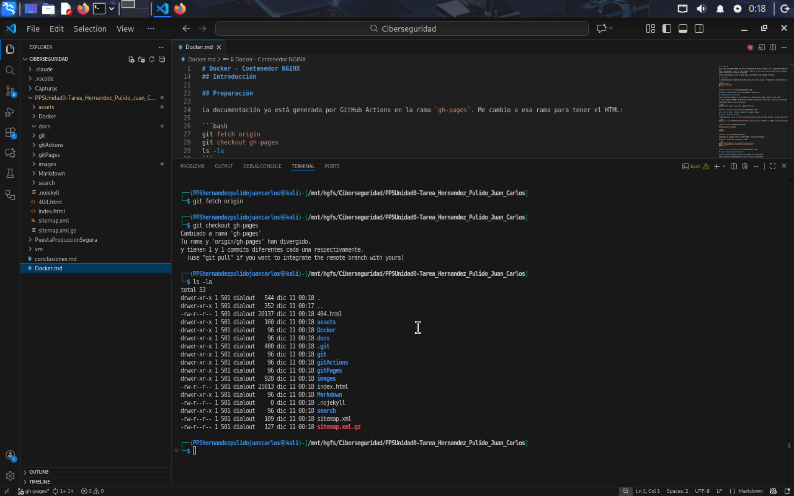
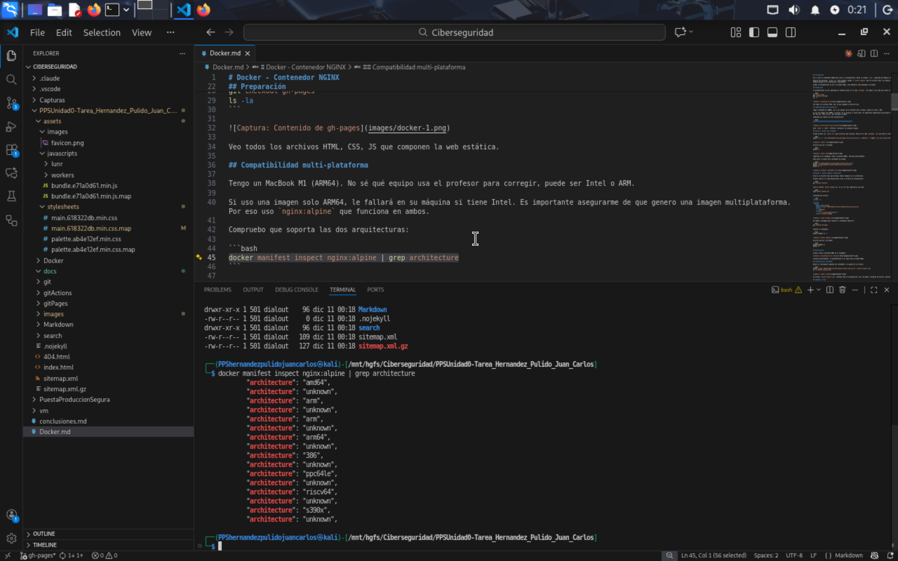
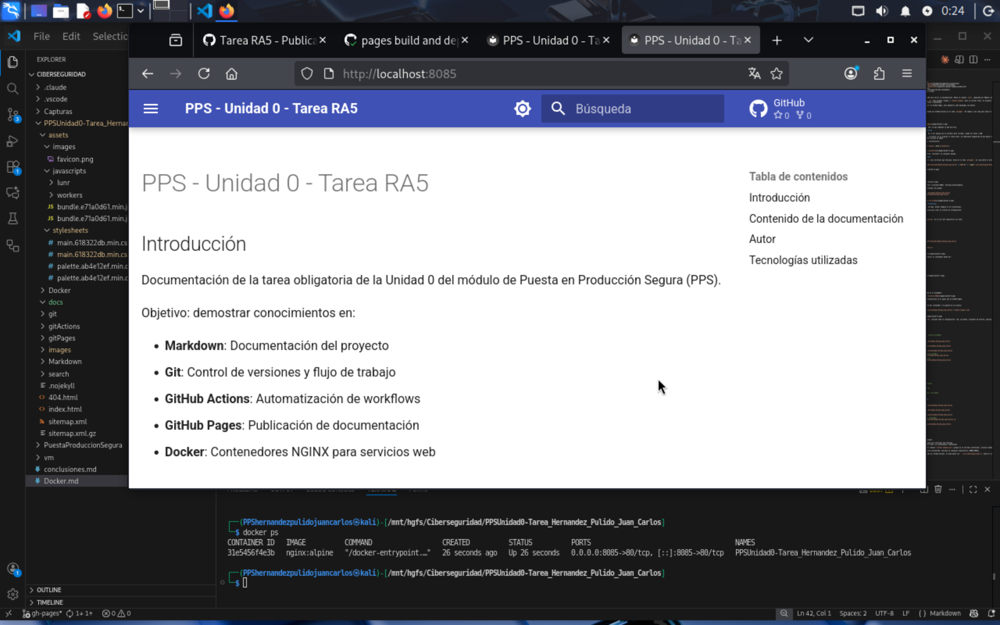
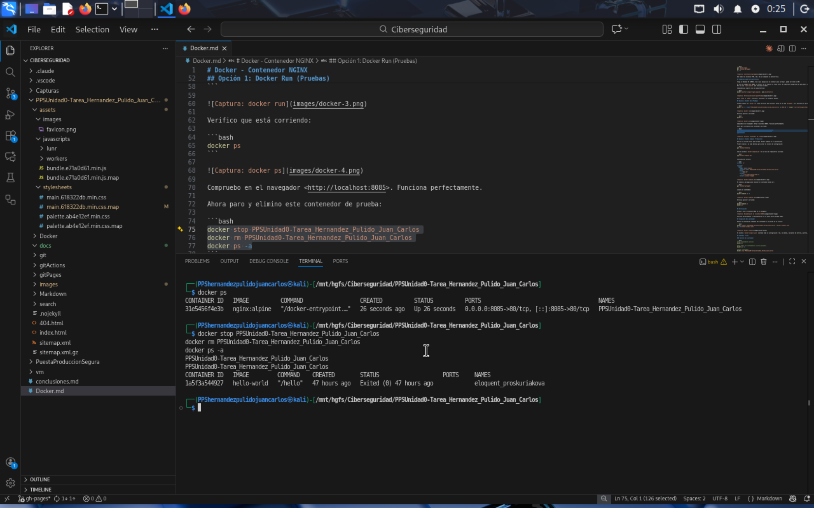
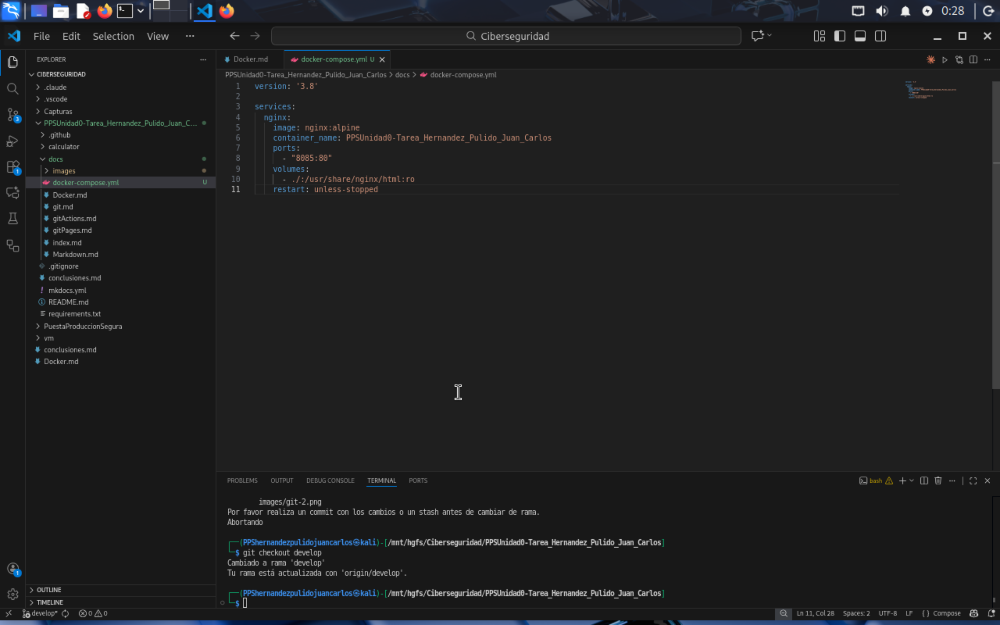

# Docker - Contenedor NGINX

## Índice

- [Introducción](#introducción)
- [Preparación](#preparación)
- [Compatibilidad multi-plataforma](#compatibilidad-multi-plataforma)
- [Opción 1: Docker Run (Pruebas)](#opción-1-docker-run-pruebas)
- [Opción 2: Docker Compose (Producción)](#opción-2-docker-compose-producción)
- [Verificación](#verificación)
- [Inspección del contenedor](#inspección-del-contenedor)

## Introducción

Voy a crear un contenedor NGINX para servir la documentación. Monto la carpeta `site/` (generada por MkDocs) en el contenedor NGINX.

Muestro dos opciones: `docker run` para pruebas rápidas, y `docker-compose` para la versión final. El proyecto se entrega con Docker Compose porque es más profesional y mantenible.

Aunque la documentación ya está en GitHub Pages, esto demuestra cómo desplegar con Docker.

## Preparación

La documentación ya está generada por GitHub Actions en la rama `gh-pages`. Me cambio a esa rama para tener el HTML:

```bash
git fetch origin
git checkout gh-pages
ls -la
```



Veo todos los archivos HTML, CSS, JS que componen la web estática.

## Compatibilidad multi-plataforma

Tengo un MacBook M1 (ARM64). No sé qué equipo usa el profesor para corregir, puede ser Intel o ARM.

Si uso una imagen solo ARM64, le fallará en su máquina si tiene Intel. Es importante asegurarme de que genero una imagen multiplataforma. Por eso uso `nginx:alpine` que funciona en ambos.

Compruebo que soporta las dos arquitecturas:

```bash
docker manifest inspect nginx:alpine | grep architecture
```



Sale `arm64` y `amd64`. Perfecto, funcionará en cualquier equipo.

## Opción 1: Docker Run (Pruebas)

Pruebo primero con `docker run` para verificar que funciona. Estoy en la rama `gh-pages`, así que monto el directorio actual:

```bash
docker run -d --name PPSUnidad0-Tarea_Hernandez_Pulido_Juan_Carlos -p 8085:80 -v "$(pwd)":/usr/share/nginx/html:ro nginx:alpine
```


Verifico que está corriendo:

```bash
docker ps
```



Compruebo en el navegador <http://localhost:8085>. Funciona perfectamente.

Ahora paro y elimino este contenedor de prueba:

```bash
docker stop PPSUnidad0-Tarea_Hernandez_Pulido_Juan_Carlos
docker rm PPSUnidad0-Tarea_Hernandez_Pulido_Juan_Carlos
docker ps -a
```



## Opción 2: Docker Compose (Producción)

Esta es la versión final que entrego. Docker Compose es más profesional.

Primero vuelvo a la rama develop para crear el archivo de configuración:

```bash
git checkout develop
```

Creo el archivo `docker-compose.yml` en la raíz del repositorio con la interfaz de Visual Studio Code

Contenido del archivo:

```yaml
version: '3.8'

services:
  nginx:
    image: nginx:alpine
    container_name: PPSUnidad0-Tarea_Hernandez_Pulido_Juan_Carlos
    ports:
      - "8085:80"
    volumes:
      - ./:/usr/share/nginx/html:ro
    restart: unless-stopped
```



Ahora necesito realizar un PR de develop a master para actualizar la documentación y disponer del fichero docker-compose.yml
Me cambio a gh-pages para levantar el contenedor desde ahí:

```bash
git checkout gh-pages
```

Levanto el contenedor:

```bash
docker-compose up -d
```


Verifico que está corriendo:

```bash
docker-compose ps
docker ps
```

## Verificación

Accedo a http://localhost:8085 en el navegador:


Funciona perfectamente. La documentación se ve igual que en GitHub Pages.

## Inspección del contenedor

Genero la información completa del contenedor y la guardo en un archivo:

```bash
docker inspect PPSUnidad0-Tarea_Hernandez_Pulido_Juan_Carlos > docker-inspect.json
ls -lh docker-inspect.json
```


El archivo `docker-inspect.json` contiene toda la configuración: red, volúmenes, variables de entorno, puertos, etc.
