# Git - Gestión del Repositorio

## Índice

- [Creación de clave ssh](#creación-de-clave-ssh)
- [Creación del repositorio](#creación-del-repositorio)
  - [Invitar colaborador](#invitar-colaborador)
  - [Clonar el repositorio](#clonar-el-repositorio)
- [Estructura del repositorio](#estructura-del-repositorio)
  - [Crear rama develop](#crear-rama-develop)
  - [Creación de estructura del repositorio](#creación-de-estructura-del-repositorio)
  - [Verificar la estructura](#verificar-la-estructura)
- [Configuración de Git ignore](#configuración-de-git-ignore)
- [Pull Request](#pull-request)
  - [Verificar el PR](#verificar-el-pr)
- [Merge del Pull Request](#merge-del-pull-request)
  - [Revisión](#revisión)
  - [Merge desde CLI](#merge-desde-cli)
- [Actualizar main local](#actualizar-main-local)
- [Comandos Git utilizados](#comandos-git-utilizados)
- [Básicos](#básicos)
- [Ramas](#ramas)
- [Pull Requests (GitHub CLI)](#pull-requests-github-cli)
- [Trabajo con gh-pages](#trabajo-con-gh-pages)

## Creación de clave SSH

Configuro una nueva clave SSH en mi instancia Kali y mi cuenta GitHub

``` bash
    ssh-keygen -t ed25519 -C "juancarloshernandezpulido@gmail.com"
    ssh-add .ssh/id_ed25519
    cat .ssh/id_ed25519.pub 
```


## Creación del repositorio

Primero creo el repo en GitHub. Lo de siempre: login, "New repository", y relleno:

- **Nombre**: `PPS-Unidad0-Tarea-hernandez_pulido_juan_carlos`
- **Privado** 


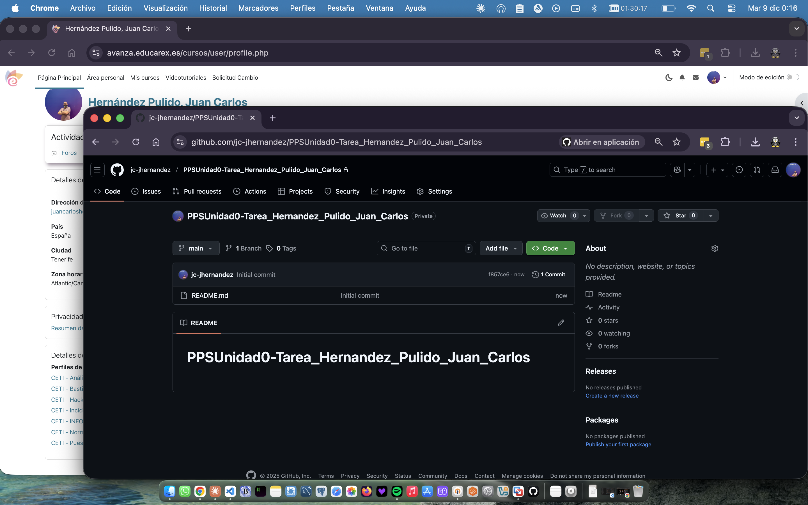

_**Nota:** Durante la ejecución de la tarea descubrí un error al crear el repositorio privado. Procedo a modificarlo y hacerlo público_

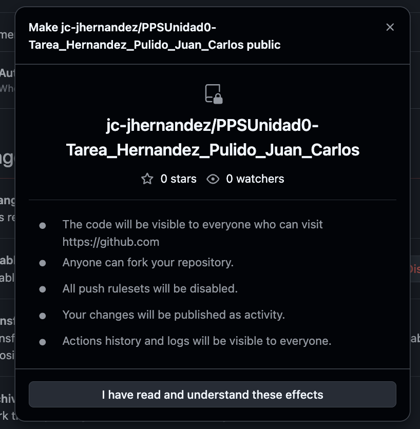

## Invitar colaborador

Tal y como se indica en la tarea, invito al colaborador PPSvjp

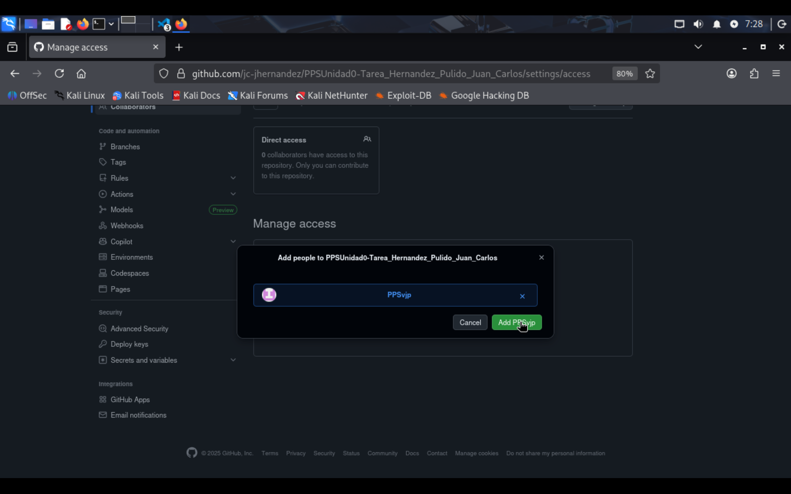
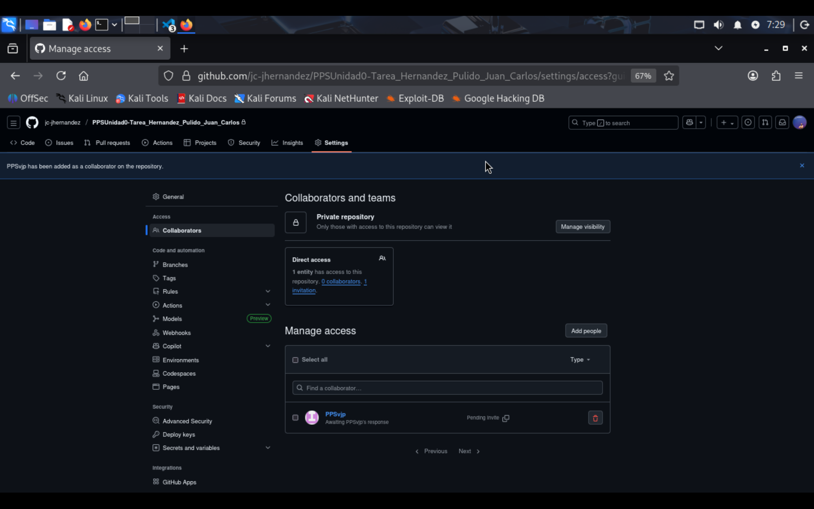

## Clonar el repositorio

Una vez creado, lo clono:

```bash
git clone git@github.com:jc-jhernandez/PPSUnidad0-Tarea_Hernandez_Pulido_Juan_Carlos.git
cd PPSUnidad0-Tarea_Hernandez_Pulido_Juan_Carlos
```

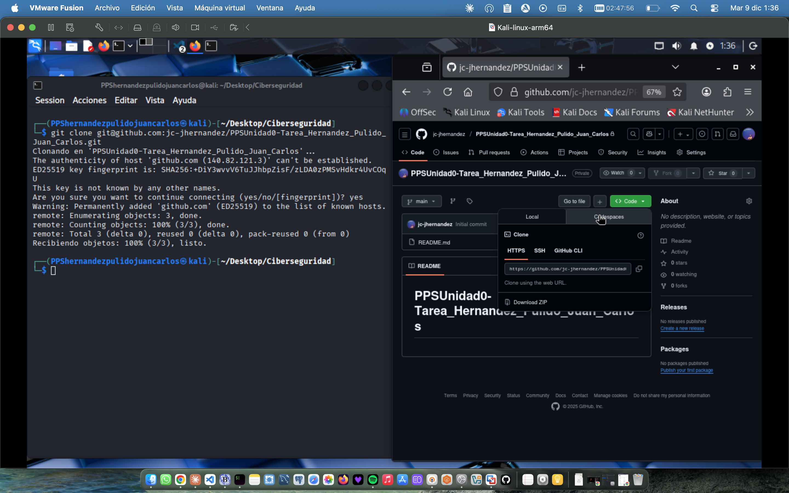

## Estructura del repositorio

Voy a configurar el repositorio siguiendo los pasos indicados en la documentación. Realizaré el primer commit, y la generación del README.md en la rama main
```bash
  git config --global user.name jc-jhernandez
  git config --global user.mail juancarloshernandezpulido@gmail.com
  git config --global init.defaultBranch main
  git config --global core.editor nano
  git config --global core.pager
  tree -a .git 
  git commit -am "repositorio inicializado"
  nano README.md
  git status
  git add .
  git status
  git commit -am "creado archivo README.md"
  git push origin main
```

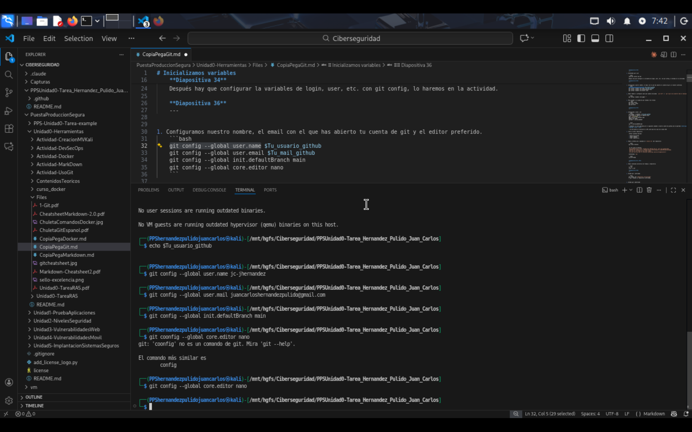
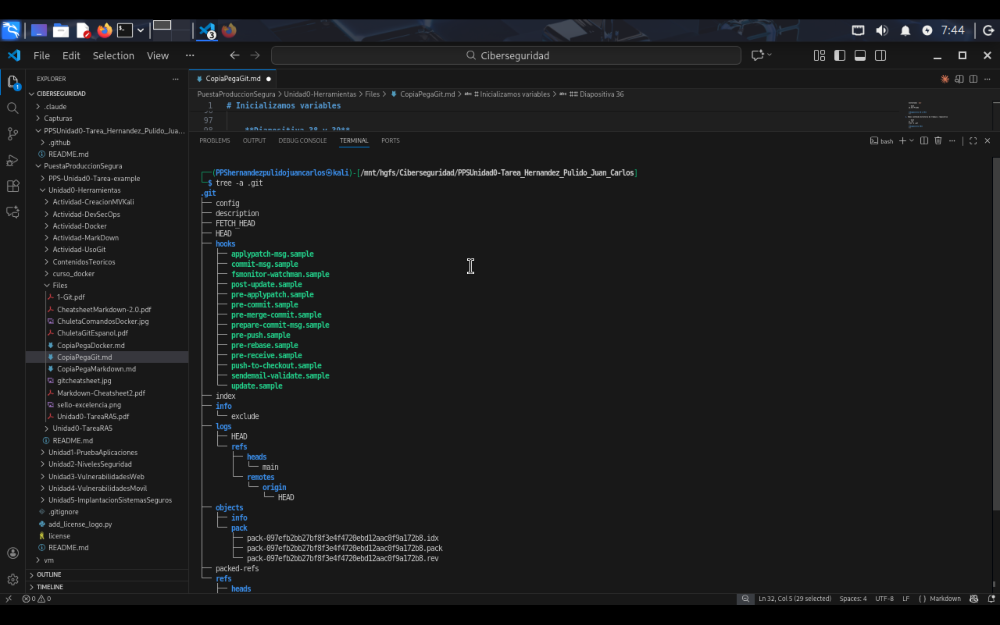
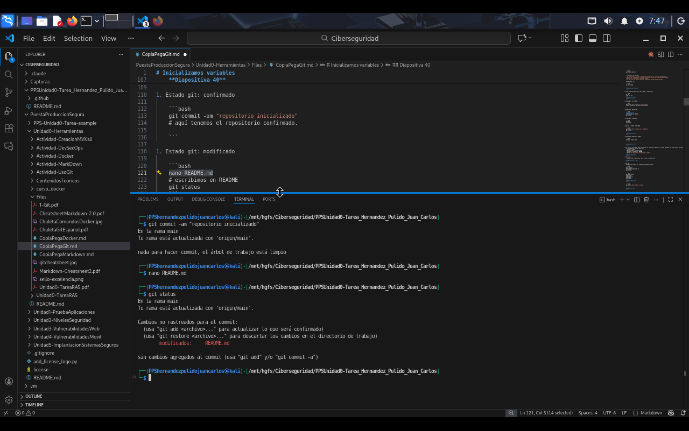


## Crear rama develop

Por buenas prácticas, voy a trabajar por defecto en la rama develop. Una vez verificado y completadas las tareas, realizaré pull request a la rama principal main.

```bash
git checkout -b develop
```

## Creación de estructura del repositorio

```bash
  mkdir -p calculator docs .github/workflows images
  touch calculator/__init__.py calculator/gui.py  docs/index.md mkdocs.yml requirements.txt 
  cp '/mnt/hgfs/Ciberseguridad/PuestaProduccionSegura/Unidad0-Herramientas/Files/CopiaPegaGit.md' git.md
  cp '/mnt/hgfs/Ciberseguridad/PuestaProduccionSegura/Unidad0-Herramientas/Files/CopiaPegaMarkdown.md' Markdown.md
  cp '/mnt/hgfs/Ciberseguridad/PuestaProduccionSegura/Unidad0-Herramientas/Files/CopiaPegaDocker.md' Docker.md
```
Resultado de la ejecución

- **calculator/** con `__init__.py` y `gui.py`
- **docs/** con los 6 archivos .md necesarios, tomamos los ficheros de ejemplo como referencia
- **.github/workflows/** con el workflow de Actions
- **mkdocs.yml** configurado
- **requirements.txt** con las dependencias
- **Dockerfile**
- **images/** para las capturas realizadas durante la practica
- **README.md** (ya existente)


## Verificar la estructura

```bash
ls -la
```

**¿Por qué images/?**

Las capturas van ahí. Es más limpio que tenerlas sueltas en la raíz. Las referencias quedan mejor: `images/nombre.png`.

La estructura queda así:

```
PPS-Unidad0-Tarea-Hernandez_Pulido_Juan_Carlos/
├── calculator/
│   ├── __init__.py
│   └── gui.py
├── docs/
│   ├── index.md
│   ├── git.md
│   ├── gitActions.md
│   ├── gitPages.md
│   ├── docker.md
│   └── conclusiones.md
├── mkdocs.yml
├── requirements.txt
├── .gitignore
└── .github/
    └── workflows/
        └── CreacionDocumentacion.yml
```

Realizo el commit y creación de la rama en el repositorio remoto


```bash
  git add .
  git commit -am "Creación estructura archivos"
  git push --set-upstream origin develop
  git push
  git checkout -b develop
```


## Configuración de Git ignore

Configuro un `.gitignore` para no subir basura:

```
# Python
__pycache__/
*.py[cod]
*$py.class
*.so
.Python
env/
venv/

# MkDocs
site/

# IDEs
.vscode/
.idea/
*.swp
*.swo

# OS
.DS_Store
Thumbs.db
```

Voy a realizar el commit del .gitignore y de todas las capturas. En este caso voy a usar la interfaz de Visual Studio Code para proporcionar otro ejemplo.


Solo se realizan estas acciones en interfaz como ejemplo. Proseguiremos la realización de la practica mediante comandos git para afianzar el conocimiento.


## Pull Request

Vamos a proceder a crear una primera entrega desde la rama develop a la rama master. Utilizaremos la interfaz cli gh

```bash
gh auth login

gh pr create \
  --base main \
  --head develop \
  --title "Tarea RA5 - primer PR" \
  --body "## Resumen de cambios

Esta PR incluye primeros pasos de la tarea RA5:

### ✅ Completado

- [x] Estructura del repositorio creada
- [ ] Documentación en Markdown (index, git, gitActions, gitPages, docker, conclusiones)
- [ ] Configuración de MkDocs (mkdocs.yml)
- [ ] Workflow de GitHub Actions para documentación automática
- [ ] Configuración de GitHub Pages
- [ ] Instrucciones de Docker/Docker Compose para NGINX
- [x] Archivos de configuración (.gitignore, requirements.txt)"
```


## Verificar el PR

```bash
gh pr view
gh pr list
gh pr view --web
```

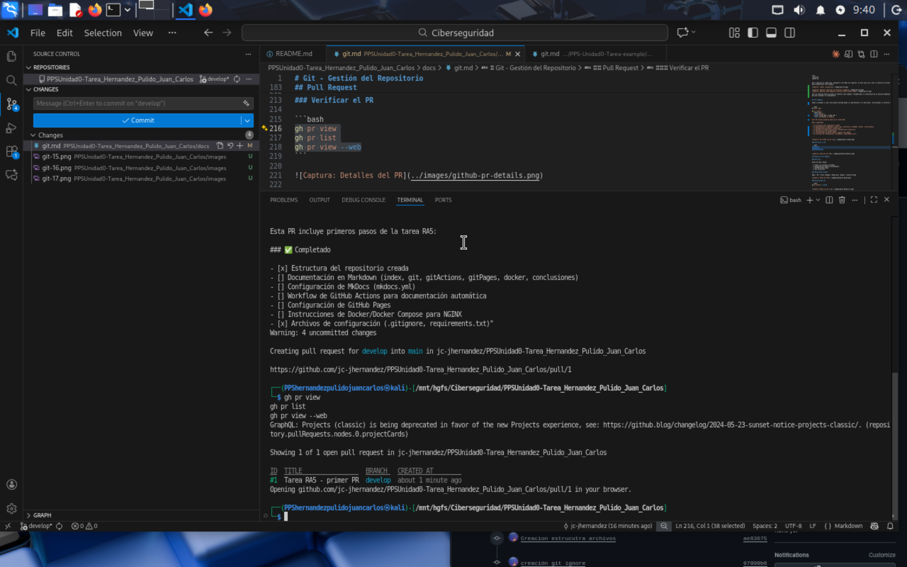

## Merge del Pull Request

## Revisión

Antes de hacer merge:

- ✅ Todos los archivos incluidos
- ✅ Documentación genera correctamente
- ✅ GitHub Actions pasa
- ✅ Sin conflictos

_**Nota:** Los PR tienen como objetivo la revisión cruzada de código entre los miembros del equipo. Cuando se trabaja individualmente pierden parte de su utilidad. De cualquier forma nos facilitan el seguimiento de las tareas y cambios_

Visualización en la web del PR

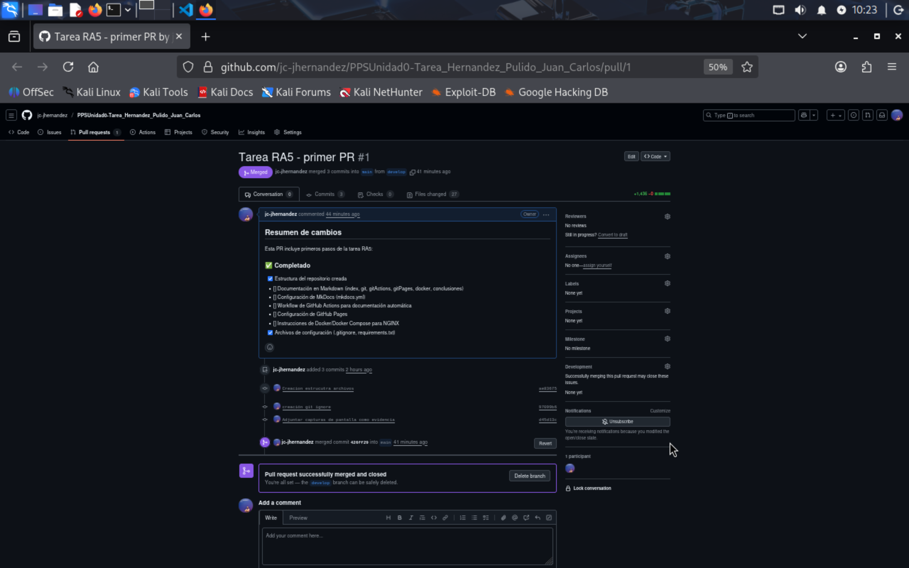

## Merge desde CLI

```bash
gh pr merge 1 --merge
```


## Actualizar main local

Después del merge:

```bash
git checkout main
git pull origin main
git log --oneline -5
```

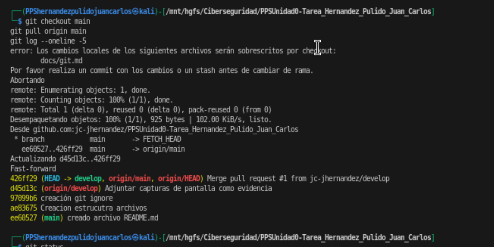

## Comandos Git utilizados

## Básicos

| Comando | Descripción |
|---------|-------------|
| `git status` | Ver estado |
| `git add .` | Añadir cambios |
| `git commit -m "mensaje"` | Crear commit |
| `git push` | Subir cambios |
| `git pull` | Descargar cambios |

## Ramas

| Comando | Descripción |
|---------|-------------|
| `git branch` | Listar ramas |
| `git branch -a` | Todas las ramas |
| `git checkout -b nombre-rama` | Crear y cambiar rama |
| `git checkout nombre-rama` | Cambiar rama |
| `git merge nombre-rama` | Fusionar rama |
| `git branch -d nombre-rama` | Eliminar rama |

## Pull Requests (GitHub CLI)

| Comando | Descripción |
|---------|-------------|
| `gh auth login` | Autenticarse |
| `gh pr create` | Crear PR |
| `gh pr list` | Listar PRs |
| `gh pr view` | Ver detalles |
| `gh pr merge` | Fusionar PR |
| `gh pr view --web` | Abrir en navegador |

## Trabajo con gh-pages

```bash
git fetch origin
git checkout gh-pages
```

Esta rama contiene la documentación compilada por MkDocs.

