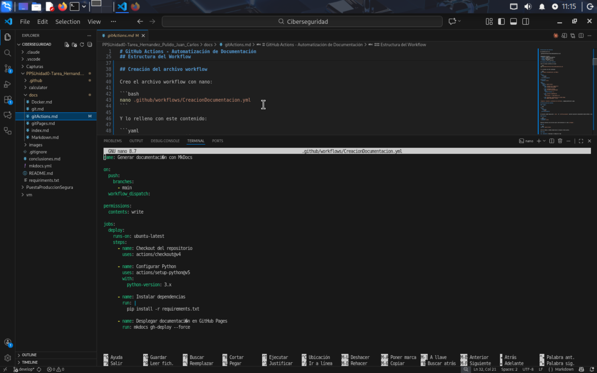
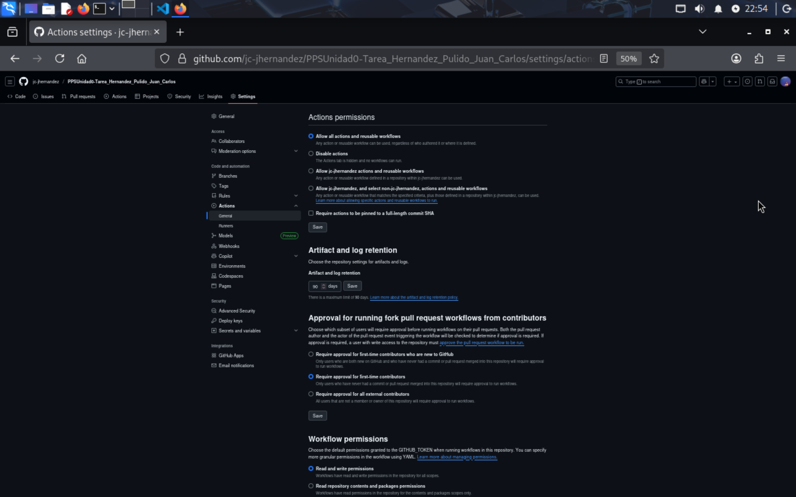
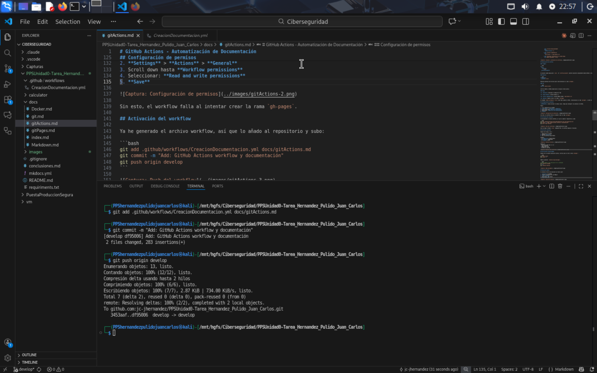
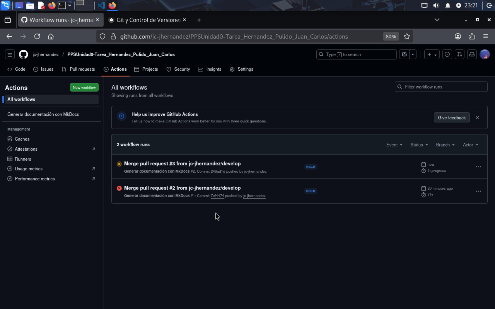
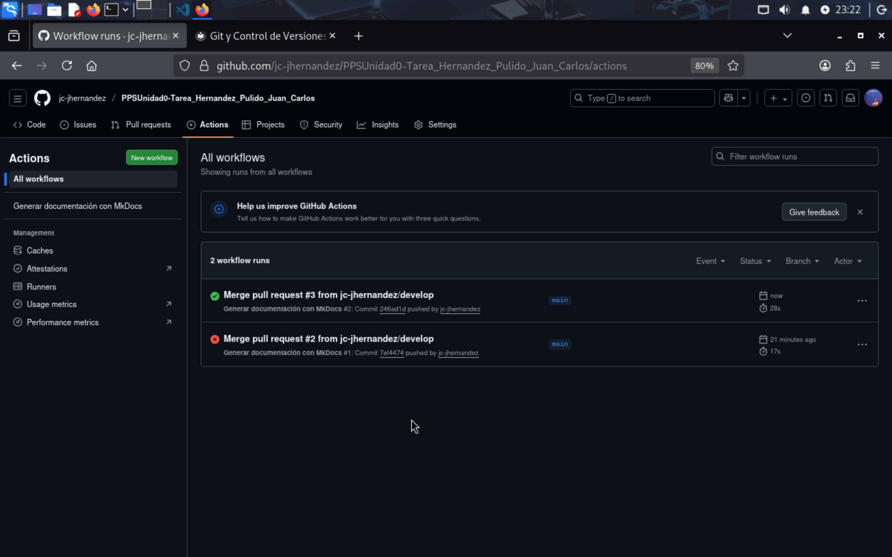
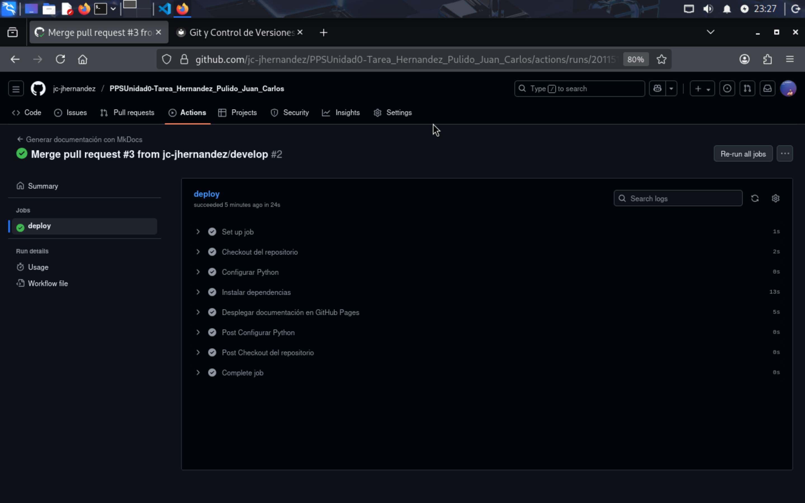
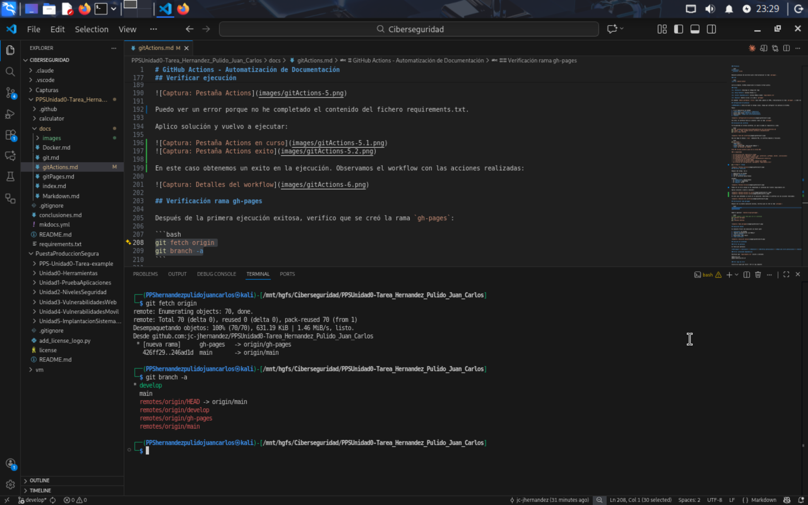
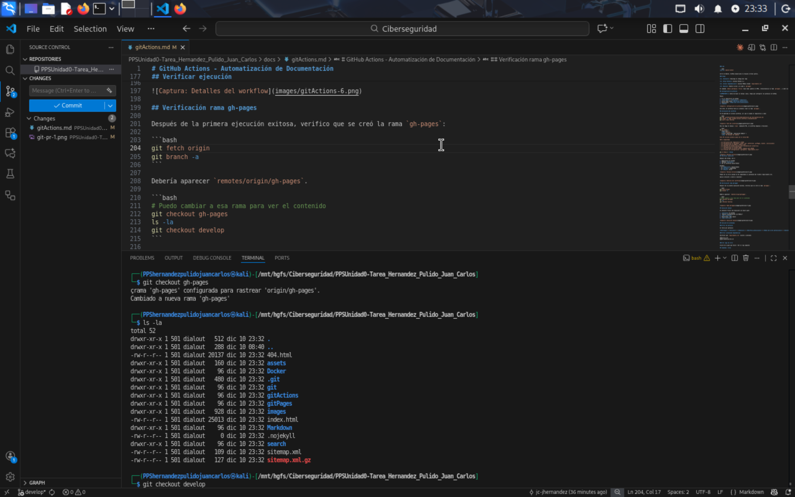
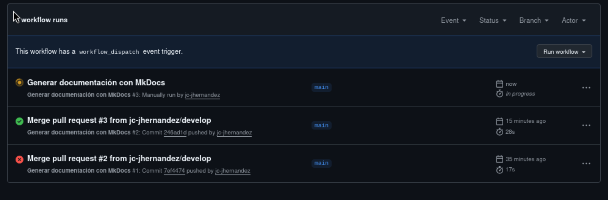

# GitHub Actions - Automatización de Documentación

## Índice

- [Introducción](#introducción)
- [Estructura del Workflow](#estructura-del-workflow)
- [Creación del archivo workflow](#creación-del-archivo-workflow)
- [Explicación del workflow](#explicación-del-workflow)
- [Configuración de permisos](#configuración-de-permisos)
- [Activación del workflow](#activación-del-workflow)
- [Verificar ejecución](#verificar-ejecución)
- [Verificación rama gh-pages](#verificación-rama-gh-pages)
- [Ejecución manual](#ejecución-manual)
- [Solución de problemas](#solución-de-problemas)
- [Comandos útiles](#comandos-útiles)

## Introducción

GitHub Actions automatiza el proceso de generar y publicar la documentación. Cada vez que hago push a `main`, se ejecuta un workflow que:

- Genera la documentación con MkDocs
- La publica en GitHub Pages (rama `gh-pages`)
- Todo automático, sin intervención manual

## Estructura del Workflow

El workflow está en:
```
.github/workflows/CreacionDocumentacion.yml
```

Componentes básicos:
- **name**: Nombre del workflow
- **on**: Cuándo se ejecuta
- **jobs**: Qué hace
- **steps**: Pasos concretos

## Creación del archivo workflow

Creo el archivo workflow con nano:

```bash
nano .github/workflows/CreacionDocumentacion.yml
```

Y lo relleno con este contenido:

```yaml
name: Generar documentación con MkDocs

on:
  push:
    branches:
      - main
  workflow_dispatch:

permissions:
  contents: write

jobs:
  deploy:
    runs-on: ubuntu-latest
    steps:
      - name: Checkout del repositorio
        uses: actions/checkout@v4

      - name: Configurar Python
        uses: actions/setup-python@v5
        with:
          python-version: 3.x

      - name: Instalar dependencias
        run: |
          pip install -r requirements.txt

      - name: Desplegar documentación en GitHub Pages
        run: mkdocs gh-deploy --force
```



## Explicación del workflow

### Triggers

```yaml
on:
  push:
    branches:
      - main
  workflow_dispatch:
```

Se ejecuta cuando hago push a `main`. El `workflow_dispatch` permite ejecutarlo manualmente desde GitHub si hace falta.

### Permisos

```yaml
permissions:
  contents: write
```

Necesita permisos de escritura para crear/actualizar la rama `gh-pages`.

### Job

```yaml
runs-on: ubuntu-latest
```

Corre en Ubuntu. GitHub proporciona la máquina virtual gratis.

### Steps

**1. Checkout**: Descarga el código del repo

**2. Setup Python**: Instala Python 3.x

**3. Install dependencies**: Instala MkDocs desde `requirements.txt`

**4. Deploy**: Genera la doc y la sube a `gh-pages`

El comando `mkdocs gh-deploy --force` hace todo: genera el HTML, crea/actualiza la rama `gh-pages`, y sube los cambios.

## Configuración de permisos

**IMPORTANTE:** Antes de hacer el merge a main, tengo que configurar los permisos en GitHub.

Pasos:

1. Ir al repositorio en GitHub
2. **Settings** > **Actions** > **General**
3. Scroll down hasta **Workflow permissions**
4. Seleccionar: **Read and write permissions**
5. **Save**



Sin esto, el workflow falla al intentar crear la rama `gh-pages`.

## Activación del workflow

Ya he generado el archivo workflow, así que lo añado al repositorio y subo:

```bash
git add .github/workflows/CreacionDocumentacion.yml docs/gitActions.md
git commit -m "Add: GitHub Actions workflow y documentación"
git push origin develop
```



Una vez hago el merge a `main` (mediante PR), el workflow empieza a funcionar.

```bash
gh pr create \
  --base main \
  --head develop \
  --title "Tarea RA5 - Aplicación mkdocs" \
  --body "## Resumen de cambios

Esta PR incluye primeros pasos de la tarea RA5:

### ✅ Completado

- [x] Estructura del repositorio creada
- [x] Documentación en Markdown (index, git, gitActions, gitPages, docker, conclusiones)
- [x] Configuración de MkDocs (mkdocs.yml)
- [x] Workflow de GitHub Actions para documentación automática
- [ ] Configuración de GitHub Pages
- [ ] Instrucciones de Docker/Docker Compose para NGINX
- [x] Archivos de configuración (.gitignore, requirements.txt)"

gh pr merge 2 --merge
```


## Verificar ejecución

Después del merge, voy a:

1. Repositorio en GitHub
2. Pestaña **Actions**
3. Ver el workflow ejecutándose

Estados:
- 🟡 **Amarillo**: Ejecutándose
- 🟢 **Verde**: Completado
- 🔴 **Rojo**: Error


Puedo ver un error porque no he completado el contenido del fichero requiriments.txt.

Para solucionarlo, hago uso del mkdocs en local

```bash
  pip install
  mkdocs serve --dev-addr=0.0.0.0:8000
```
Resultado en local:


Vuelvo a realizar PR a producción con todos los cambios. En ese caso ya conseguimos



Observamos el detalle del workflow realizado con exito y sus pasos:



## Verificación rama gh-pages

Después de la primera ejecución exitosa, verifico que se creó la rama `gh-pages`:

```bash
git fetch origin
git branch -a
git checkout gh-pages
ls -la
git checkout develop
```




## Ejecución manual

Si necesito forzar una ejecución sin hacer push:

1. **Actions** en GitHub
2. "Generar documentación con MkDocs"
3. **Run workflow**
4. Seleccionar rama (main)
5. **Run workflow**



