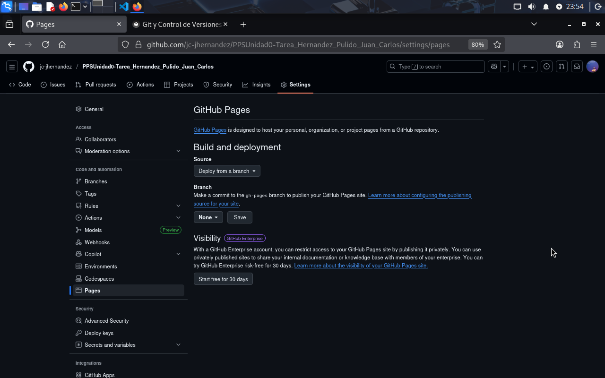
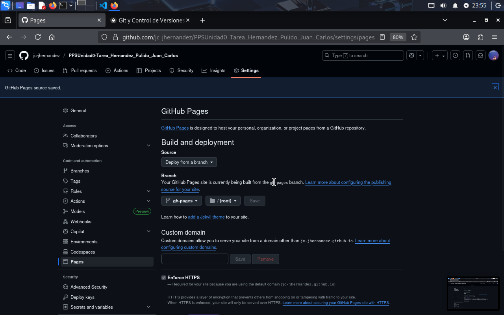
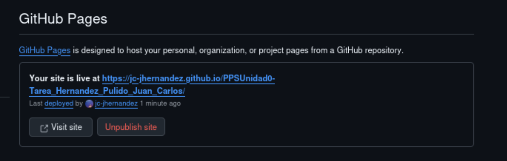
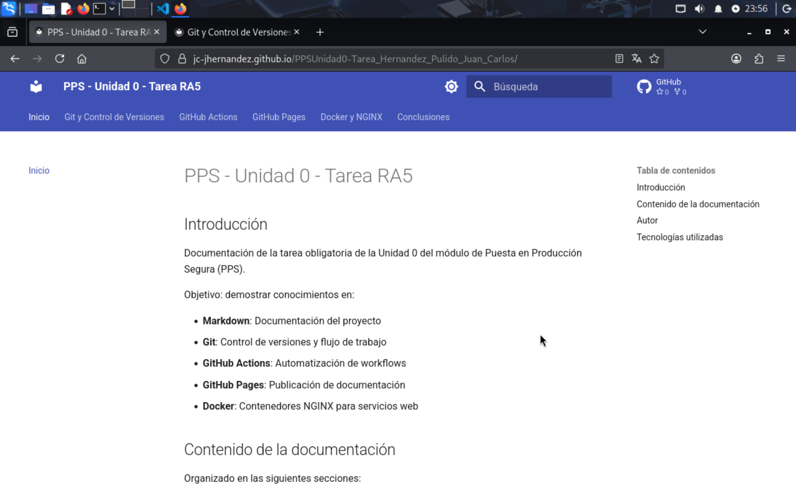

# GitHub Pages - Publicación

## Índice

- [Introducción](#introducción)
- [Configuración](#configuración)
- [Acceso a la documentación](#acceso-a-la-documentación)
- [URLs](#urls)

## Introducción

GitHub Pages publica sitios estáticos gratis. MkDocs genera el HTML, GitHub Actions lo sube a `gh-pages`, y GitHub Pages lo sirve.

Todo automático, sin configurar nada.

## Configuración

Ya tengo la rama `gh-pages` creada (GitHub Actions la generó en el workflow anterior).

Voy a configurar GitHub Pages:

**Settings** > **Pages**



En **Build and deployment**:

- **Source**: Deploy from a branch
- **Branch**: `gh-pages` / (root)
- **Save**



Tarda unos minutos. Cuando termina, aparece la URL.



## Acceso a la documentación

Mi documentación está en:

```
https://jc-jhernandez.github.io/PPSUnidad0-Tarea_Hernandez_Pulido_Juan_Carlos/
```

Abro la URL y funciona:




## URLs

| Recurso | URL |
|---------|-----|
| Repositorio | https://github.com/jc-jhernandez/PPSUnidad0-Tarea_Hernandez_Pulido_Juan_Carlos |
| **GitHub Pages** | **https://jc-jhernandez.github.io/PPSUnidad0-Tarea_Hernandez_Pulido_Juan_Carlos/** |
| Actions | https://github.com/jc-jhernandez/PPSUnidad0-Tarea_Hernandez_Pulido_Juan_Carlos/actions |
